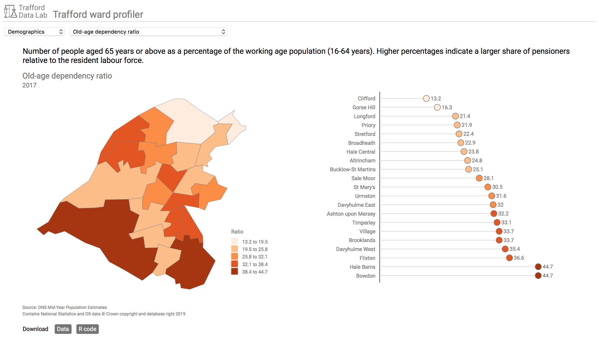

## Sheffield ward profiler

An app allowing users to visualise indicators for the 28 Sheffield wards categorised by theme. The choropleth map and lollipop chart show how the indicator varies across Sheffield. The <a href="https://github.com/laurie-platt/ward_profiler/data" target="_blank">data</a> and the <a href="https://github.com/laurie-platt/ward_profiler/data" target="_blank">R code</a> to obtain and clean the data are available to download using the buttons provided. The app includes a brief introduction to the wards.

Main differences from fork origin:
1. Sheffield wards rather than Trafford
2. More self-contained e.g. includes ward_data
3. Relative paths

The original Trafford app can be viewed at <a href="https://www.trafforddatalab.io/ward_profiler/" target="_blank">https://www.trafforddatalab.io/ward_profiler/</a> and you can bookmark individual indicators.

 

 
